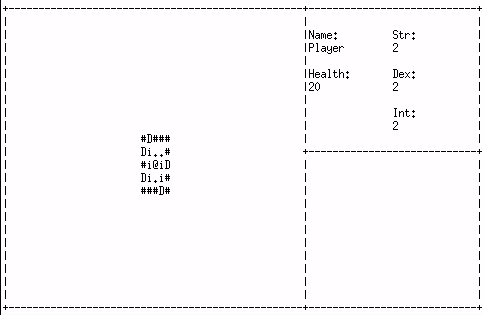

# C# Roguelike
This a basic rougelike I made in Monodevelop just to mess around and I didn't want to use any external libraries.
The code is pretty awful and basically everything needs to be changed but it is in a vaguely playable state.
I've only tested this on Linux but in theory it should run on Windows and Mac maybe with some small changes.

## Controls
  * Movement - QWEADZXC
  * Select - Enter
  * Change Mode - Space

You can open door and attack enemies by moving into them.  
Pressing Space will cycle between Movement, interact mode and inventory menu.  
you can pick stuff up by using the interact mode and then selecting the item with the direction keys and pressing enter.  
You can equip or use items by selecting them and pressing enter on the inventory menu.  

## Characters
* Player @
* Floor .
* Wall #
* Door D/d
* Item i
* Enemy e
